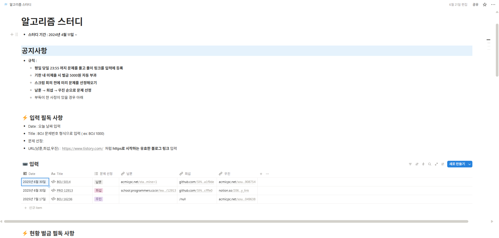
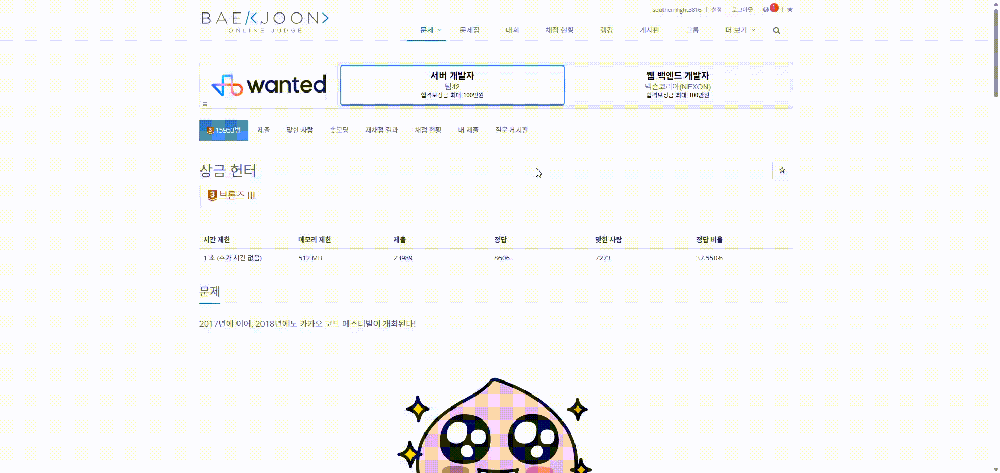
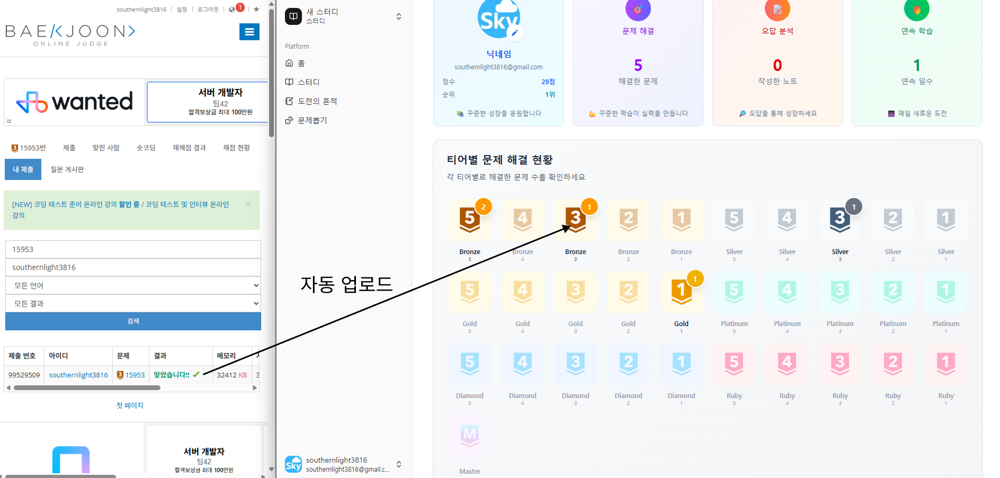
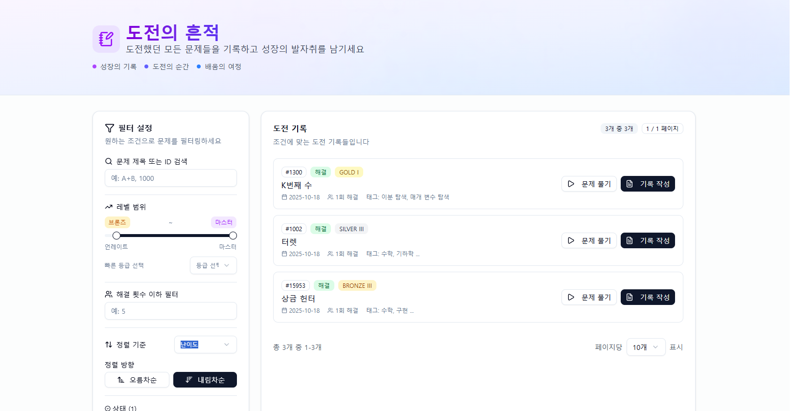
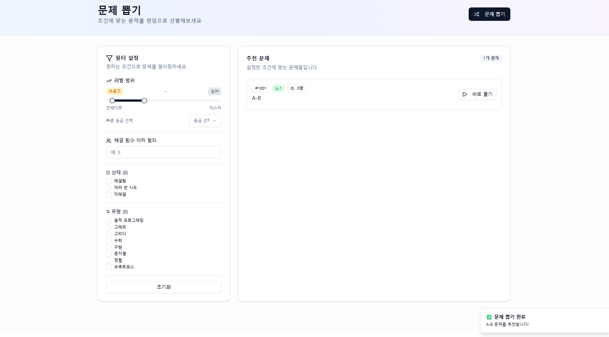
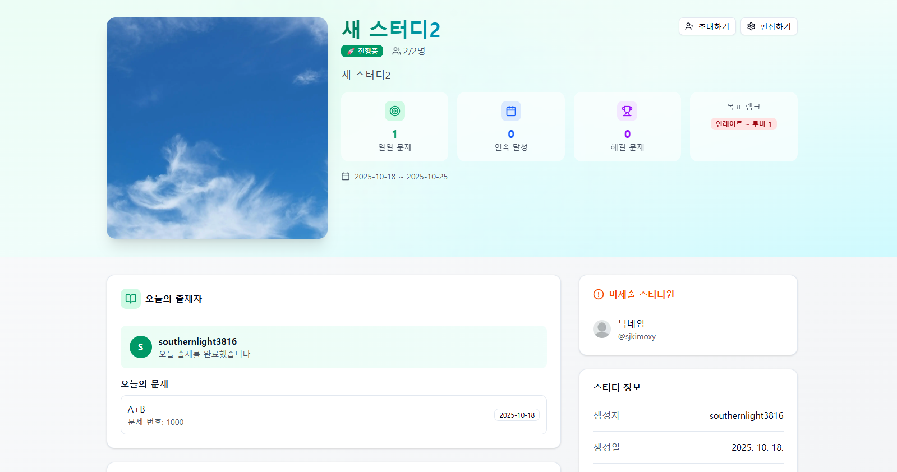
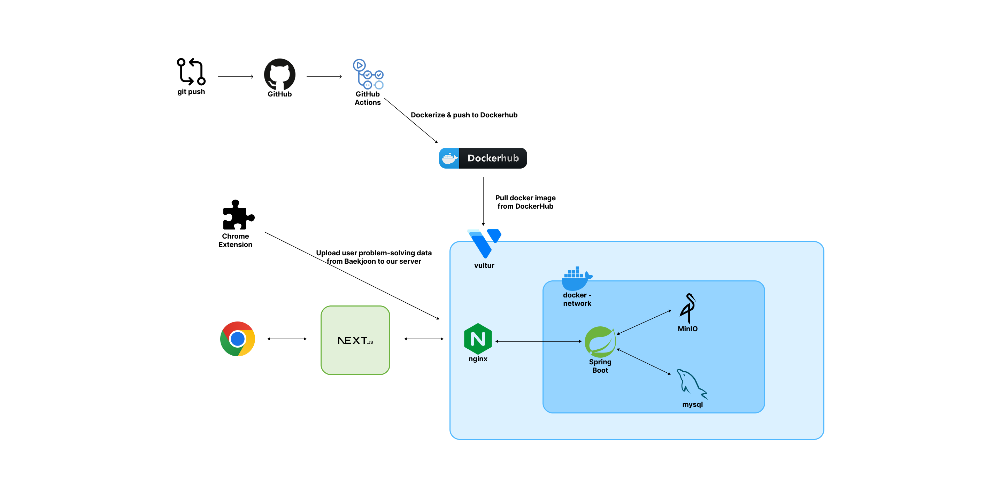

<h1 align="center">
  
   
  SkyIsTheLimit
    
</h1>

---

## 📑 목차

1. [프로젝트 소개](#-프로젝트-소개)
2. [배포 주소](#-배포-주소)
3. [기술 스택](#-기술-스택)
4. [주요 기능 요약](#-주요-기능-요약)
5. [실제 서비스 모습](#-실제-서비스-모습)
6. [아키텍처](#-아키텍처)
7. [개발 인원 및 기간](#-개발-인원-및-기간)

---

## 📘 프로젝트 소개

> **Chrome Extension을 통해 백준 문제 풀이 데이터를 자동으로 수집**하고,  
> 개인 학습 관리와 스터디 협업 관리 기능을 제공하는 플랫폼입니다.

사용자는 브라우저에 제공되는 크롬 익스텐션을 설치하면,  
익스텐션이 사용자의 백준 문제 풀이 활동을 감지하여 **자동으로 서버로 전송**합니다.  
서버는 수집된 데이터를 기반으로 개인 통계, 문제 추천, 스터디별 진행률 등을 계산하고 시각화합니다.

### 💡 개발 동기

알고리즘 스터디를 진행하면서,  
각자의 문제 풀이 현황을 매번 수동으로 공유하고 관리하는 과정이 **비효율적**이었습니다.  
또한 개인 학습의 꾸준함을 유지할 수 있는 관리 도구가 부족하다는 문제를 느꼈습니다.

이러한 문제를 해결하기 위해, 저는 백준 문제 풀이 결과를 자동으로 수집하고 그 데이터를 기반으로 한 개인 학습 통계 제공, 개인별 학습 기록
관리가 가능한 플랫폼을 직접 개발하게 되었습니다.
또한 스터디 참여자 간 학습 현황을 자동으로 공유하여 **스터디의 효율을 높이기 위해** SkyIsTheLimit을 개발하게 되었습니다.

  
 노션으로 진행했던 알고리즘 스터디 모습(수동) 

   
  

    
  

---

## 🌐 배포 주소

🔗 **서비스 주소:** [https://skyisthelimit.cloud](https://skyisthelimit.cloud) \
🔗 **API 문서 (Swagger):**
[https://api.skyisthelimit.cloud/swagger-ui.html](https://api.skyisthelimit.cloud/swagger-ui.html)
> 로그인 및 API 요청은 Google OAuth2 인증 기반으로 이루어집니다.

---

## 🛠 기술 스택

| 분야       | 기술                                          |
|----------|---------------------------------------------|
| Backend  | Spring Boot, Spring Security, JPA, QueryDSL |
| Database | MySQL                                       |
| Infra    | Vultr, Docker, Nginx, MinIO, Glowroot       |
| Auth     | Google OAuth2, JWT                          |
| Tools    | GitHub Actions, Locust                      |

---

## ✨ 주요 기능 요약

| 구분                     | 기능 설명                                                                                           |
|------------------------|-------------------------------------------------------------------------------------------------|
| 🔄 **문제 풀이 데이터 자동 수집** | - Chrome Extension 설치 시 백준 문제 풀이 기록 자동 서버 전송 - 문제 난이도, 알고리즘 종류 등 정보 함께 수집 - 개인 학습 기록으로 저장 |
| 📊 **문제 관리 & 문제 뽑기**   | - 조건별 문제 검색 및 페이지 단위 조회 - 랜덤 문제 추천 기능 제공 - 오답 노트 기능으로 틀린 문제 관리                            |
| 👥 **스터디 기능**          | - 스터디 참여자별 학습 현황 집계 - 연속 학습 일수 및 문제 해결 현황 통계 제공 - 매일 출제자를 자동 지정하여 문제 출제 순환                |

## 🖥 실제 서비스 모습

> 주요 기능 위주로 보여드립니다.

### 🔄 1. 문제 풀이 데이터 자동 수집

  

    <b>문제 자동 업로드</b> 
    
  

  

    <b>개인 학습 기록 화면</b> 
    
  

- Chrome Extension 설치 시 백준 문제 풀이 기록 자동 서버 전송
- 문제 난이도, 알고리즘 종류 등 정보 함께 수집
- 개인 학습 기록으로 저장

### 📊 2. 문제 관리

  

    <b>도전의 흔적</b> 
    
  

  

    <b>랜덤 문제 뽑기</b> 
    
  

- 조건별 문제 검색 및 페이지 단위 조회
- 랜덤 문제 추천 기능 제공
- 오답 노트 기능으로 틀린 문제 관리

### 👥 3. 스터디 기능

  📸 문제 관리 화면 
  

- 스터디 참여자별 학습 현황 집계
- 연속 학습 일수 및 문제 해결 현황 통계 제공
- 매일 출제자를 자동 지정하여 문제 출제 순환

## 🏗 아키텍처

- **Vultr :**  서버 호스팅
- **Nginx :** Reverse Proxy 역할
- **Spring Boot  :**  API 처리, 인증/인가
- **MySQL/MinIO  :** 관계형 데이터 /파일데이터 저장
- **CI/CD(GitHub Actions) :** GitHub에 코드 push시 애플리케이션 도커 & 도커 허브에 업로드 → Vultr 서버가 이미지 pull 후, 컨테이너
  실행
- **Chrome Extension :**  백준 문제 풀이(문제 번호, 정답 여부 등) 데이터 수집 및 서버 전송

---

## 👥 개발 인원 및 기간

| 구분    | 내용                                         |
|-------|--------------------------------------------|
| 개발 인원 | 2명 (FE 1명 / BE 1명)                         |
| 개발 기간 | 2025.08.22 ~ (FE 개발 진행중)                   |
| 역할    | 백엔드 전담 개발 (인증/인가, 통계, 스터디 관리, API 설계 및 배포) |

